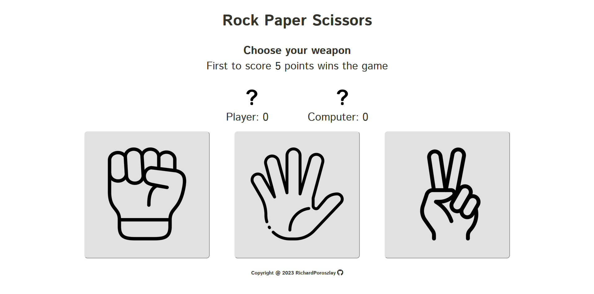

# Rock-Paper-Scissors

## Live Preview 🪨

You can play with the game [HERE!](https://richardporoszlay.github.io/Rock-Paper-Scissors/)

## Game Layout 📃

## Rules of the game ✂️

If you don't know how to play the game, check out this [Wikipedia site.](https://en.wikipedia.org/wiki/Rock_paper_scissors)

## TODO❕

- I would like to make the project **responsive**, so the users could play it on various devices.
- I like animations, so I'll consider to add some.

## Licensing 🏛

The icons used in the project are made by fantastic artists, who I want to mention here:

- "Rock" icon made by Cuputo ([Cuputo's Flaticon page](https://www.flaticon.com/authors/cuputo))
- "Paper" icon made by Vitaly Gorbachev ([Vitaly Gorbachev's Flaticon page](https://www.flaticon.com/authors/vitaly-gorbachev))
- "Scissors" icon made by Pixel perfect ([Pixel perfect's Flaticon page](https://www.flaticon.com/authors/pixel-perfect))
